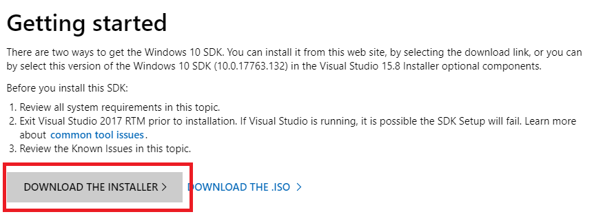

# HoloRekognition
HoloRekognition is a Microsoft HoloLens Facial identification and recognition application. It is an academic project planned and developed in the Winter of 2019 by the following individuals as a part of the capstone requirement for the BYU Marriott School of Business MISM Program: 

* [Levi Bowser](https://github.com/LeviBowser)
* [Nathan Barton](https://github.com/nbarton915)
* [Cameron Spilker](https://github.com/CameronSpilker)

Additional backend utilities were created through this capstone to interact with Azure Face API:

* [CustomPersonMaker](https://github.com/nbarton915/CustomPersonMaker): Created As Convenience Utility For Integrating Project HoloRekognition With Azure Face Resource - Create, train, fetch, update, and delete (people and groups)
* [Person Group Python Utility](https://github.com/CameronSpilker/DownloadPersonGroupInformation): Created As Convenience Utility For Integrating Project HoloRekognition And Azure Face Resource - Download Person Group Information from your Azure Face Resource

There are two applications for the project that can be used **Single_Photo_HoloRekog** and **Face_Tracking_HoloRekog**.

## Single_Photo_HoloRekog
An application that uses the tap gesture to take a photo and then locate/identify and recognize faces in the photo using Microsoft's Azure Face API. After a face is located, a 3D face rectangle is placed around the individuals face. If the face is recognized, any information that was connected to the face is displayed around the face rectangle. Please keep in mind that each photo taken places **TWO** api calls to the Face API. One for location/identification and another for face recognition.

Distance was estimated using approximations of face rectangle size; i.e. the smaller the face, the larger the estimated distance will be.

Face management and resource creation was done using the [CustomPersonMaker](https://github.com/nbarton915/CustomPersonMaker) and [Person Group Python](https://github.com/CameronSpilker/DownloadPersonGroupInformation) utilities.

## Face_Tracking_HoloRekog
An application that tracks faces by processing individual frames. It creates face rectangles using the [FaceDetector](https://docs.microsoft.com/en-us/uwp/api/Windows.Media.FaceAnalysis.FaceDetector#Windows_Media_FaceAnalysis_FaceDetector_CreateAsync) class, as well as a plugins whose links were documented in the code, to move or create face rectangles that are updated every few frames.

This application works, but not very well.

### **Please note: This was *not* the main focus of this project and was essentially abandoned halfway through. The code is neither clean nor readable. It has comments throughout, testing variables still in place, and chunks of code commented out. A large portion of the codes commented out were efforts to integrate *Single_Photo_HoloRekog* in real-time. Issues with threading and API call management, limited time, compounded with limitied knowledge, required focus to shift back to the *Single_Photo_HoloRekog* and the utilities that were being developed.**

# Development Environment Walk-through
*The following is a quick walk-through for convenience. It goes through setting up the requirements to edit, deploy, and run the applications. This project is currently **NOT** being maintained. Please take care, as there are no guarantees for the projects.*

# Objective(s)
* To run the application for face recognition, the development environment must have an up-to-date version of visual studio (community addition is fine), Unity (community/personal use edition is fine) and then HoloToolkit plugin attached to Unity.
* Please note that the instructions for starting a new project from scratch and having it work on the Hololens require additional steps. Namely, setting the scenes, the SDK, and build structure. Although a little dated, this tutorial will get you on the right track.
    * [https://docs.microsoft.com/en-us/windows/mixed-reality/holograms-100](https://docs.microsoft.com/en-us/windows/mixed-reality/holograms-100)
    * [https://circuitstream.com/hololens-unity-setup/](https://circuitstream.com/hololens-unity-setup/ )

# Prerequisite(s) 
* Windows 10
* Time

# Visual Studio
1. **Windows 10** is required.
1. Download Visual Studio Community **(2017 version is required)**
    1. [Visual Studio](https://developer.microsoft.com/en-us/windows/downloads)
1. Step through the install wizard. It may take some time for the install to complete.
1. A pop up window will appear, if you don’t want to create an account just click **Not now, maybe later**
1. Click **Start Visual Studio**
1. Also, you will want to make sure you have the **Windows 10 SDK**. It should come with the latest version of Visual Studio if your windows machine is updated fully. But go ahead and download and install from the link below:
    1. [Windows 10 SDK](https://developer.microsoft.com/en-us/windows/downloads/windows-10-sdk)
    1. Click **Download Installer**
    

* Select the Build tab
* Change the platform target to x86 and then save the properties (CTRL + S)

* Build the project
* Select Local Machine as the debug target
* Start debugging

# Create
## Person Group
A Person Group is the Face resource object that contains Persons. You must create/fetch a Person Group before working with Persons

* Enter the Face Resource Key in Step 1
* Enter a text id for the Person Group ID in step 2
  * This must be lowercase and a single word without spaces
* Enter a friendly text name for the Person Group Name in step 2
* Click Create Person Group to create the group

## Person
The Person object contains the Name, User Data, and Facial Recognition model for a person

* Enter the First and Last name of the Person in Step 3
* Click Create Person to create the Person object in the Person Group

## User Data
User Data is optional but can be added as one or more key/value (label/value) pair. Create a list of these data pairs before submitting to Azure to be associated with the Person.

* Add a Label in the first text box of Step 4
* Add a Value associated with the Label in the second text box of Step 4
* Click Add To List to add that pair to the User Data list
* Repeat this until you have all the data that you would like to be associated with the Person
* Click Submit User Data to save the User Data list you created

## Person Images
Training the recognition model requires at least 10 good quality photos of the person. These photos must be isolated to contain only the person’s face

* Collect, or take, 10 photos of a person’s face.

## Create/Open Photo Folder
For ease of use, the Custom Person Maker creates a folder for the Person in the Pictures directory.

* Click Create/Open Folder button
* Put the photos collected in step 5 in the folder created

## Submit To Azure
This step should be completed after the photos have been put in the created folder in step 6.

* Click Submit To Azure
* Wait for the status to say completed

## Train
Facial recognition requires training a model based on a minimum of 10 photos. Complete this step after the photos have been submitted to Azure

* Click Train Model button

# Fetch
Each Person Group or Person must be fetched before working with them after creation. For example, in order to add additional User Data on John Smith you will need to fetch the Person Group using the Person Group ID, and fetch the Person by entering John Smith in the text box and clicking the Fetch Person button. You will then see the User Data associated with John Smith and can then add additional User Data to the list and re-submit.

# Delete
To delete a Person Group or Person, first, fetch the resource and then click on the delete button. That resource (Person Group or Person) will be removed permanently with all of the associated data.

# Summary
If you need to interface with the data in the Face resource, this application will allow you to create, train, fetch, update, and delete all items in the resource. 
